# Agile Beer Brewing
### Jens Hinrichs

- https://twitter.com/jensblond
- https://bunhaus.beer

---

# Bier brauen (Grundlagen)

---

### Mälzen

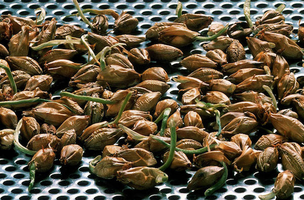

Getreide (meist Gerste) wird zum Keimen gebracht und gleich wieder getrocknet,
so entstehen bestimmte Emzyme die später die Stärke in Maltose umwandeln.

---

### Schroten

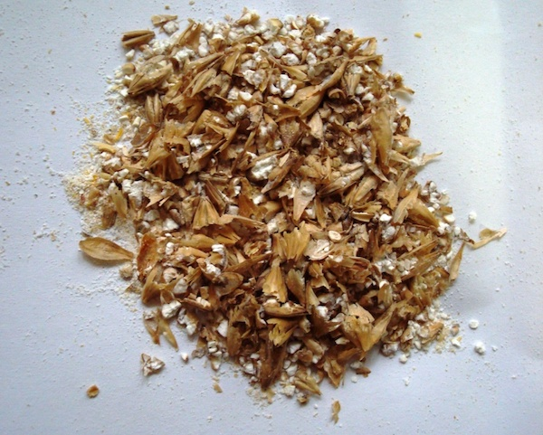

Das Malz muss vorher geschrotet werden, dabei ist es wichtig, dass die Spelzen intakt bleiben.

---

### Maischen

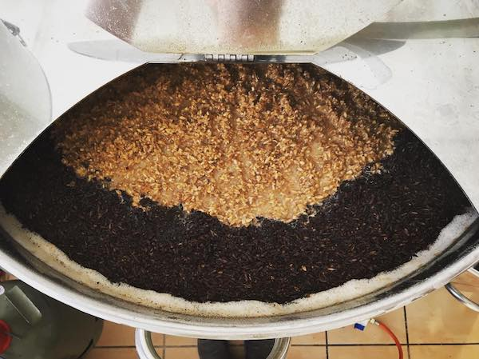

Das Malz wir mit Wasser vermischt und auf verschiedene Temperaturen gebracht.
Hier kommen die Enzyme zum Einsatz die bei verschiedenen Temperaturen arbeiten.

---

### Läutern

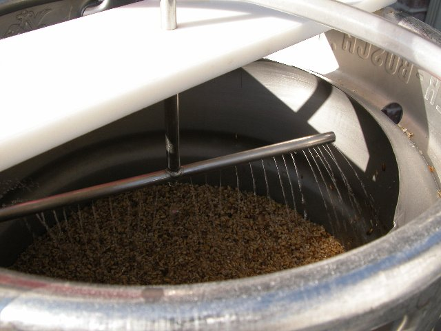

Hierbei wird die Maische in Treber und Würze getrennt, dabei bilden die Spelzen
ein natürliches Sieb. Der Restzucker wird mit Nachguß aus dem Treber gespült

---

### Würzekochen

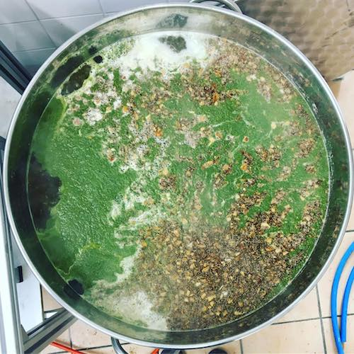

Hierbei wir der Hopfen gekocht, meist für eine Stunde. Dabei entstehen die
Bitterstoffe als auch andere Hopfenaromen. Danach wird die Würze durch einen
Whirlpool "ausgeschlagen"

---

### Kühlen

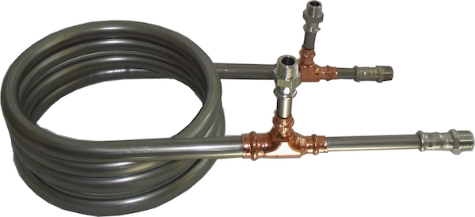

Die heiße Würze wird auf eine Temperature von 25 Grad Celsius runtergekühlt.

---

### Gärung

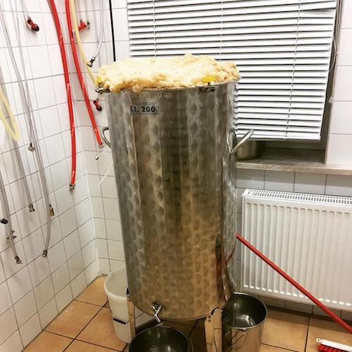

Mit der Hefe wird die abgekühlte Würze in Bier umgewandelt, dabei wandelt die
Hefe den Malzzucker in Alkohol und CO2 um.

---

### Lagerung

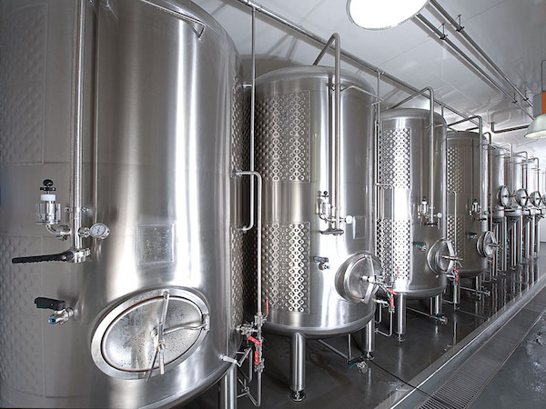

Nachdem die Hauptgärung fertig ist und das Bier in geschlossene Behältnisse
umgefüllt ist, wird es noch für einige Wochen gelagert.

---

# Agiles Bier Brauen

---

## Agiles Manifest

---

- **Individuen und Interaktionen** stehen über Prozessen und Werkzeugen  
- **~~Funktionierende Software~~ Leckeres Bier** steht über einer umfassenden Dokumentation  
- **Zusammenarbeit mit dem Kunden** steht über der Vertragsverhandlung  
- **Reagieren auf Veränderung** steht über dem Befolgen eines Plans  

---

### Individuen und Interaktionen

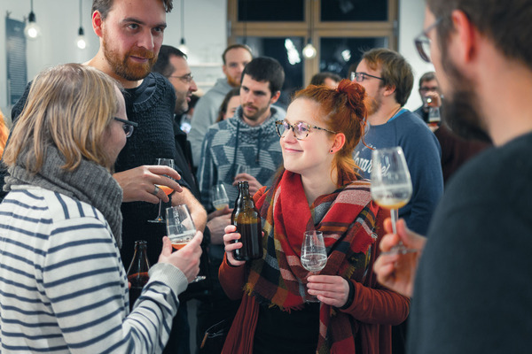

Beim Craftbeer ist die Persönlichkeit des Brauers sehr wichtig. Der Kontakt zur
Craftbeer Szene ist ein großer Unterschied zu Industriebrauereien.
Wir versuchen durch ein [Homebrewer Meetup](https://www.meetup.com/de-DE/Hamburg-Homebrewer-Meetup/) eine gute Verbindung zu Craftbeer Influencern zu erhalten.

---

### ~~Funktionierende Software~~ Leckeres Bier

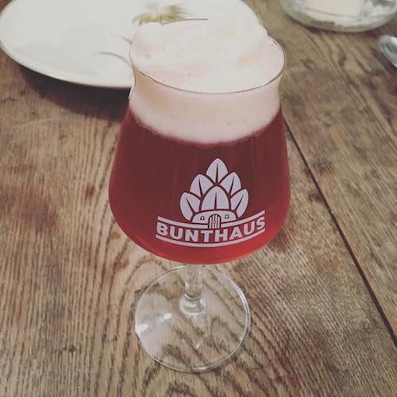

Qualität kommt über Quantität. Den Craftbeer Brauereien ist es wichtiger ein
tolles Bier herzustellen als mit einer guten Kampagne ein riesige Masse zu
verkaufen.

---

### Zusammenarbeit mit dem Kunden

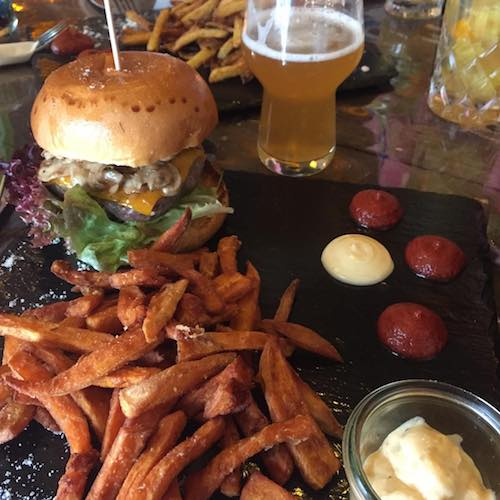

Wir arbeiten sehr eng mit einem lokalen Burger Restaurant zusammen. Hier holen
wir uns immer das Feedback der Kunden ein. Es ist eine so enge Zusammenarbeit,
dass wir sogar bestimmen, was grade am Hahn ist.

---

### Reagieren auf Veränderung

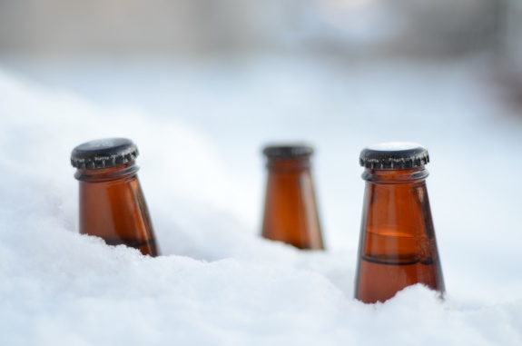

Wenn ein Bier beim Kunden mal nicht gut ankommt, dann wird es auch nicht wieder
gebraut. Mit unseren Bieren passen wir uns auch aktuellen Trends und den
Jahreszeiten an. Im Sommer gibt es frische Biere im Winter eher schwere Biere

---

## Lean

---

- Verschwendung vermeiden
- Lernen unterstützen
- So spät entscheiden wie möglich
- So früh ausliefern wie möglich
- Verantwortung an das Team geben
- Integrität einbauen
- Das Ganze sehen

---

### Verschwendung vermeiden

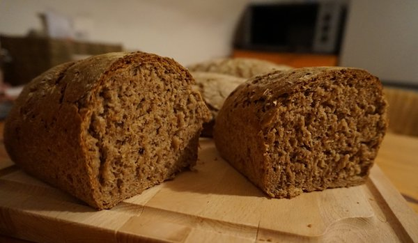

Beim Bier brauen ist einer der Reststoffe der Treber, das ist das Malz, dem
aller Zucker entzogen wurde, diese Masse ist eine sehr eiweißhaltige Masse.
Wir finden es zu schade zum entsorgen. Stattdessen benuzten wir den Treber
um davon Brot zu backen. Der Großteil davon geht an einen lokalen Landwirt,
der damit seine Rinder füttert.

---

### Lernen unterstützen

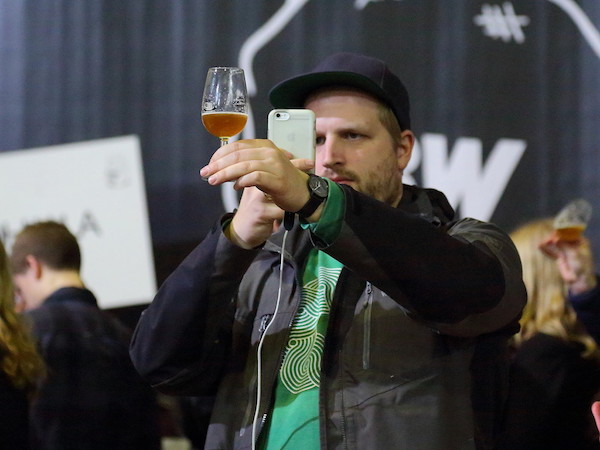

Beim Bierbrauen lernt man sehr viel über Bier, indem man es trinkt, aus diesem
Grund besuchen wir regelmäßig Bier Conventions und andere Veranstaltungen.
Auf diesen Veranstaltungen findet man die besten Kontakte.

---

### So spät entscheiden wie möglich

Manchmal kommt es vor, dass wir uns erst kurz vorm Brauen entscheiden, was wir brauen.

---

### So früh ausliefern wie möglich

Nach den 6 Wochen, die das Bier reift, geht es sofort an unseren lokalen Burgerladen,
in dem wir exklusiv ausgeschenkt werden.

---

### Verantwortung an das Team geben

Wir sind zu zweit und haben uns Grenzen gesetzt bis zu denen wir komplett alleine
entscheiden können.

---

### Integrität einbauen

Design, Auftreten und Vision müssen bei uns zusammen passen. Ganz bewusst haben
wir diesen Ort gewählt und danach benannt.

---

### Das Ganze sehen

Wir denken, nur mit einem leckeren Bier kann man nicht erfolgreich sein. Marketing
und Vertieb sind wichtige Punkte in einer erfolgreichen Brauerei

---

## Kaizen

- Prozessorientierung
- Kundenorientierung
- Qualitätsorientierung
- Kritikorientierung
- Standardisierung

---

### Prozessorientierung

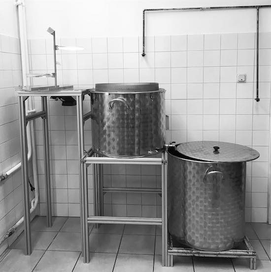

Angefangen haben wir mit einem kleinen Bierbrauset. Nachdem wir in unsere neuen
Räumlichkeiten eingezogen sind, mussten wir uns an unsere Gegebenheiten anpassen
und Prozesse finden. Mittlerweile haben wir gute Abläufe und Prozesse die ein
einfaches Brauen ermöglichen.

---

### Kundenorientierung

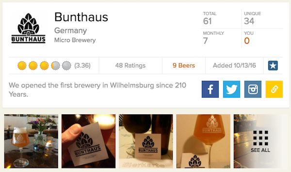

Kaizen unterteilt die Kunden in interne und externe Kunden: Wir sehen uns selbst
als unsere kritischten internen Kunden. Durch Social Media, wie Facebook oder auch
untappd versuchen wir so eng wie möglich am Kunden zu sein.
In dem Burger Restaurant gibt es einen kleinen Feedback Postkasten, hier können
die Gäste sich Biere wünschen oder sonstiges Feedback abgeben.

---

### Qualitätsorientierung

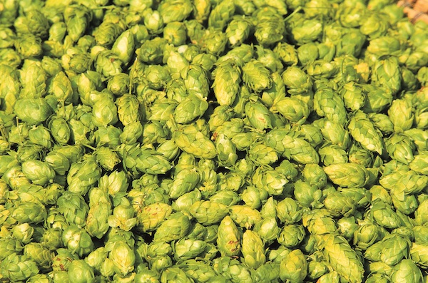

Qualität ist das größte Asset was wir haben. Durch herausragende Qualität können
wir uns gegenüber größeren Brauereien behaupten und gewinnbringend arbeiten.
Qualitätssicherung wird immer noch von uns selbst gemacht.

---

### Kritikorientierung

Obwohl oder grade weil wir zu zweit sind, kritisieren wir uns gegenseitig ohne
dass der andere sich dadurch angegriffen fühlt. Kritik ist der Schlüssel zur
Verbesserung.

---

### Standardisierung

Wir haben uns verschiedene Standards gesetzt, so ist es bei uns eine Regel,
dass das Sudhaus immer besser aussehen muss, als man es vorgefunden hat.

---

## Andere Methoden und Tools

---

### Iterationen

Wir versuchen immer besser zu werden. Unsere Biere werden es auch. Nachdem wir
ein Bier gebraut haben, versuchen wir es immer wieder zu optimieren.

---

### A/B Tests

Einige Sude werden bei uns in 2 verschiedene Teile aufgeteilt und anderes vergoren.
So verstehen wir wie sich die verschiedenen Hefen unterscheiden. Mal wird bei
einem Bier auch etwas besonderes hinzugefügt, wie z.B. Lakritz

---

### MVP

Als wir unsere Brauerei eröffnet haben, wollten wir so schnell wie möglich ein
Bier kreieren, dazu haben wir auch improvisiert, da wir noch nicht unser komplettes
Equipment zusammen hatte. Dabei fanden wir heraus, was wir noch alles benötigten.

---

### Kanban

Durch unsere begrenzte Anzahl von Fässern und unseren begrenzten Lagerraum sind
wir darauf angewiesen nicht zu viel zu produzieren.

---

### Pair brewing

Die meißten Biere brauen wir zu zweit ein. So kann man sich immer noch beraten
und es wird auch nicht langweilig.
